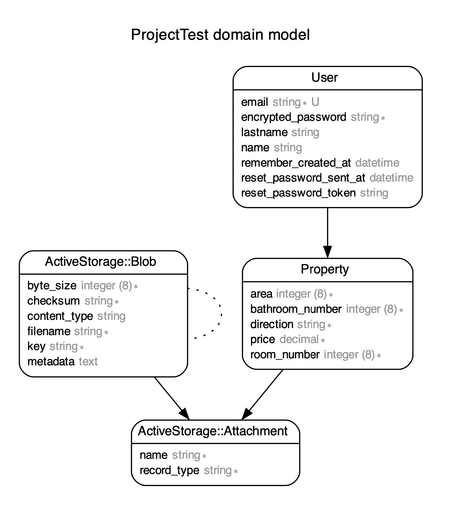

# Properties App

You can see the project here: [Properties](https://properties-project.herokuapp.com/properties)

## 1. Tech

The setup steps expect the following features to be installed on the system:

* Ruby v2.7.3
* Rails v5.2.8
* Node v19.2.0
* Yarn v1.22.18

## 2. Setup instructions

### Clone the repository

From your console:

```console
git clone git@github.com:denisseee/properties-project.git
cd properties-project
bundle
```

* *You can also download the project to your system.*

### Setup the database

```console
rails db:setup
```

* *This will run the commands:*

- ``` db:create ``` ``` db:schema:load ``` ``` db:seed ```
 
* *Leaving the database populated and ready for the implementation.*

### Run the server and Launch

```console
rails s 
```

Now you can visit the next site: [localhost:3000](http://localhost:3000). 

## 3. Diagram model

The next flowchart describes the models:

<p align="center"></p>